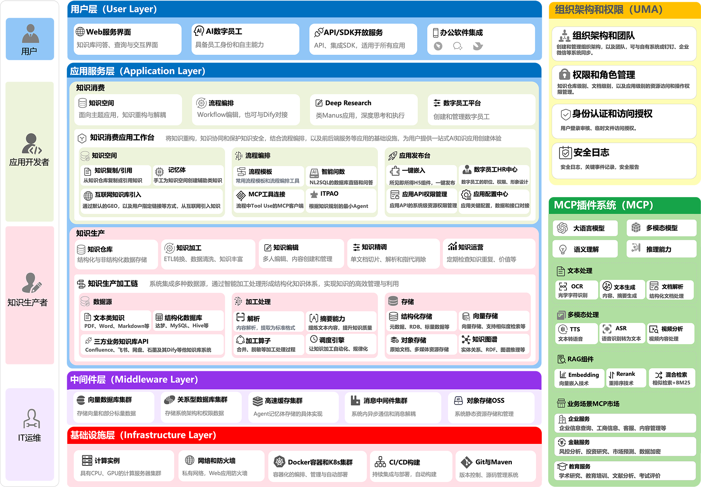

# TorchV Open Source Initiative

> 🚀 **Empowering the community with cutting-edge AI technologies and battle-tested solutions**

TorchV is committed to open-sourcing our production-grade AI algorithms, tools, and best practices accumulated from serving enterprise clients in large-scale AI implementations.

## 🎯 Mission

We believe in giving back to the open source community by sharing:

- ⚡ **Performance-optimized algorithms** from real-world deployments
- 🛠️ **Production-ready tools** that solve common AI engineering challenges  
- 📚 **Best practices** learned from enterprise-scale implementations
- 🔬 **Research insights** from our AI product development

## 🏗️ Architecture Overview

Our open source ecosystem is built around three core product lines, each addressing different aspects of AI application development:

### 🔥 Product Evolution

| Generation | Product | Focus Area | Key Innovation |
|------------|---------|------------|----------------|
| **Gen 1** | TorchV RAG | RAG + Agent Development | Multi-modal RAG pipeline with Agent orchestration |
| **Gen 2** | TorchV AIS | Knowledge Collaboration | Enterprise-scale knowledge management & AI workflow |
| **Gen 3** | TorchV KBS | Digital Workforce | AI Agent as autonomous digital employees |

## 📦 Open Source Repositories

We're actively open-sourcing components from our commercial products to benefit the community:

### 🔌 [torchv_sdk](./torchv_sdk)

> **Fast integration SDK for TorchV products**

- 🚀 Quick setup and deployment tools
- 🔧 Production-ready configurations
- 📖 Comprehensive documentation and examples
- ⚡ Optimized for enterprise environments

### 📄 [torchv-unstructured](./torchv-unstructured)

> **Advanced document parsing library**

- 📊 **PDF parsing** with layout preservation
- 📝 **Word document** structure extraction  
- 🔍 **Table reconstruction** with high accuracy
- 🎯 **Multi-format support** for enterprise documents
- 🔬 **Research-grade algorithms** from production use cases

## 🤝 Contributing

We welcome contributions from the community! Here's how you can get involved:

1. 🐛 **Report bugs** and request features via Issues
2. 💡 **Submit improvements** through Pull Requests  
3. 📚 **Improve documentation** and examples
4. 🌟 **Star** repositories you find useful
5. 🗣️ **Share** your use cases and feedback

## 📞 Connect With Us

- 🌐 **Website**: [torchv.com](https://www.torchv.com/)
- 💬 **Community**: Join our developer discussions
- 📧 **Contact**: Reach out for collaboration opportunities

---

**⭐ If you find our work helpful, please consider starring our repositories to support the project!**